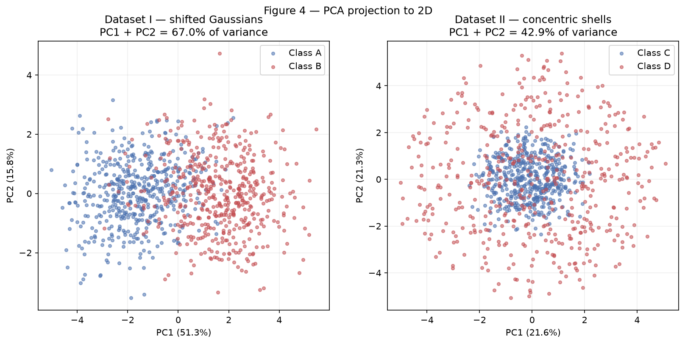
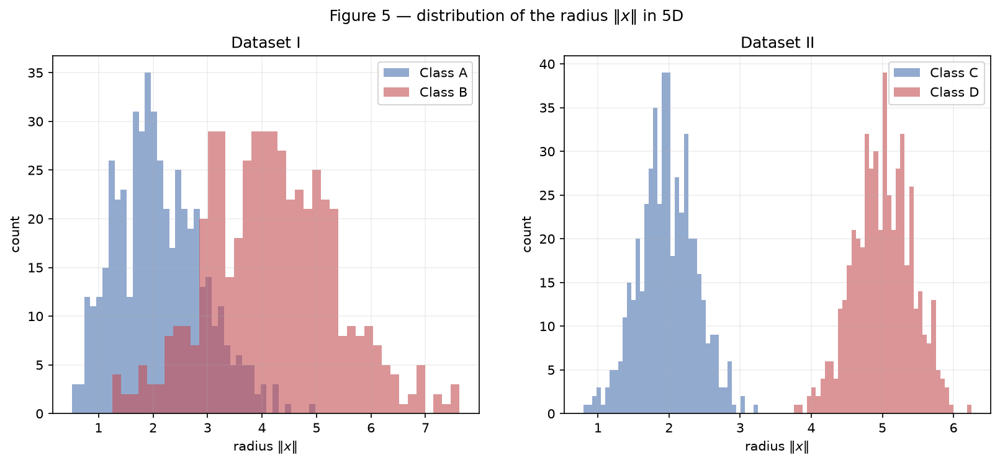
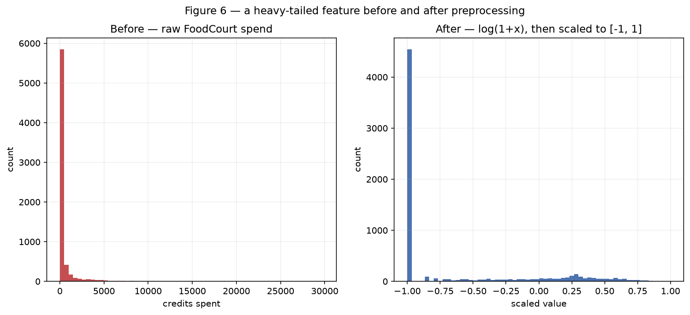

# Exercise 1 — Data

## Exercise 1

Point clouds: geometry and spread in 2D. All results use the single generator
`rng = np.random.default_rng(42)` declared once at the top of the script.

### A — Generate the clouds

400 samples split evenly across 4 classes (100 each), drawn from Gaussians with
the means and standard deviations given in the statement. Because the standard
deviations are specified per axis, each covariance is diagonal, so the clouds are
axis-aligned ellipses: class 0 (`[0.8, 2.5]`) is tall and narrow, class 2
(`[0.9, 0.9]`) is nearly circular.

Points are produced from standard normals by \(x = \mu_k + s\,\sigma_k \odot z\),
which is also what makes item B free — only \(s\) changes.

**Design decision.** The standard normals `standard_shapes` are drawn **once**,
outside `generate_clouds`, and reused at every scale factor (*common random
numbers*). The four panels of Figure 2 therefore show the *same* points merely
rescaled, so any difference between panels is caused by \(s\) alone and never by
resampling. Drawing fresh normals per scale would also be a valid reading of the
statement, but it would confound the effect of \(s\) with sampling noise.


### B — More or less spread out

The same four classes were generated four times over, with all standard
deviations multiplied by \(s \in \{0.5, 1.0, 2.0, 4.0\}\). The means never move.


#### Separation ratios at \(s = 1\)

\[ r_{ij} = \frac{\lVert \mu_i - \mu_j \rVert}{\bar{\sigma}_i + \bar{\sigma}_j},
   \qquad \bar{\sigma}_k = \frac{\sigma_{k,x} + \sigma_{k,y}}{2} \]

The ratio is dimensionless — it measures how far apart two centres are *in units
of their own spread*, which is why values from different pairs are comparable.

| Pair | \(\lVert \mu_i - \mu_j \rVert\) | \(\bar{\sigma}_i + \bar{\sigma}_j\) | \(r_{ij}\) |
|------|------|------|------|
| 0–1 | 4.243 | 3.20 | **1.326** |
| 1–2 | 5.831 | 2.45 | 2.380 |
| 0–2 | 6.325 | 2.55 | 2.480 |
| 2–3 | 7.616 | 2.15 | 3.542 |
| 1–3 | 10.198 | 2.80 | 3.642 |
| 0–3 | 13.038 | 2.90 | 4.496 |

The **smallest is the pair 0–1, at \(r_{01} = 1.326\)** — the two classes whose
centres are closest relative to how much they smear. This is visible in Figure 1
as the bleed around \(x_1 \approx 4\).

Since the means are fixed and every \(\bar{\sigma}\) is multiplied by \(s\), the
denominator scales with \(s\) while the numerator does not, so
\(r_{ij}(s) = r_{ij}(1)/s\). At \(s = 2\) the smallest ratio therefore becomes

\[ r_{01}(2) = \frac{1.326}{2} = \mathbf{0.663} \]

with no need to generate anything new.

#### Mixing rates

The mixing rate is the fraction of points whose nearest class centre is not their
own. Each point is compared against the four design means — a purely geometric
measure, nothing is trained.

| \(s\) | Mixing rate |
|------|------|
| 0.5 | 0.003 |
| 1.0 | 0.050 |
| 2.0 | 0.203 |
| 4.0 | 0.430 |


**From which scale can the clouds no longer be separated by straight lines?**
From \(s = 2\) onward. Separability degrades continuously rather than switching
off at a threshold, but \(s = 2\) is where it stops being a matter of a few
stragglers: the mixing rate quadruples from 0.050 to 0.203, so about one point in
five falls on the wrong side of every straight line drawn between the centres.

**What happens to the smallest \(r_{ij}\) there?** It crosses below 1 —
\(r_{01}(2) = 0.663\). That is the meaning of the threshold: once \(r_{ij} < 1\),
the distance between two centres is *smaller* than the spread the two clouds
carry, so their bulks physically interpenetrate. No line can separate regions that
occupy the same space. At \(s = 4\) it falls to \(r_{01}(4) = 0.332\) and the
mixing rate reaches 0.430.

### C — Analysis

**Overlap at \(s = 1\).** The four classes are mostly well separated, with one
weak point. Class 3 is isolated far to the right (\(r \geq 3.5\) against every
other class) and class 2 is compact and cleanly bounded. The genuine overlap is
between classes 0 and 1, which sit only 1.33 spread-widths apart and mix visibly
around \(x_1 \approx 4\); class 0's large vertical spread (\(\sigma_y = 2.5\))
stretches it up into class 1's territory. The measured 5.0% mixing rate is
essentially all attributable to this pair.

**Could a single linear boundary separate all classes?** No — and not because of
the geometry, but by counting. One hyperplane splits the plane into two half
spaces, so it can at best produce a 2-way decision; four classes need at least
three boundaries. A single line could only answer a binary question such as "class
3 or not".

**Could a set of linear boundaries?** Yes, at \(s = 1\), and nearly perfectly. The
regions in Figure 1b are exactly that — the nearest-centre rule partitions the
plane into Voronoi cells whose borders are straight lines (perpendicular bisectors
between centre pairs). This is why the mixing rate is the right instrument for the
question: it is literally the error rate of a piecewise-linear classifier that
already knows the true centres. At \(s = 1\) that error is 5.0%, so a set of
straight lines does almost all of the work, and a network with a single hidden
layer would have no trouble here.


**Relation to item B — what happens to the region where the network necessarily
makes mistakes?** It grows, and it becomes irreducible. The boundaries in Figure
1b do not move when \(s\) changes, because they depend only on the means, which
are fixed. What changes is how much probability mass each cloud pushes across
them. As \(s\) grows the clouds inflate over static borders, so the overlap region
fills with points of both classes; in that region the two classes are genuinely
mixed, and *no* decision rule — linear, non-linear, or arbitrarily deep — can label
both correctly, because identical positions in input space carry different labels.
This is Bayes error, not a modelling failure. The mixing-rate curve in Figure 3 is
a direct measurement of it: 0.3% at \(s = 0.5\), 43.0% at \(s = 4\). Extra network
capacity buys nothing against this; only better-separated data does.

#### Code

```python
--8<-- "docs/exercises/data/code/ex1.py"
```

## Exercise 2

Non-linearity in higher dimensions. Two 5-dimensional datasets with the same
dimensionality and sample size, differing only in how the classes are arranged.

### A — Dataset I: shifted Gaussians

500 samples per class from multivariate normals with the means and covariance
matrices given in the statement. Unlike Exercise 1, these are *full* covariance
matrices rather than per-axis standard deviations, so the clouds are tilted:
\(\Sigma_A\) has a positive correlation of 0.8 between the first two features
while \(\Sigma_B\) has \(-0.7\), and \(\Sigma_B\) carries larger variances
throughout (1.5 on the diagonal against 1.0). The two classes therefore differ in
position *and* in shape.

### B — Dataset II: concentric shells

500 samples per class, built radially. A direction is drawn uniformly on the unit
sphere of \(\mathbb{R}^5\) by sampling \(v \sim \mathcal{N}(0, I_5)\) and
normalising to \(u = v / \lVert v \rVert\); a radius is drawn from
\(\mathcal{N}(2.0, 0.4)\) for class C and \(\mathcal{N}(5.0, 0.4)\) for class
D; the point is \(x = \rho \cdot u\).

Normalising is what makes the direction uniform — without it the points would
simply be another Gaussian blob. The result is two nested spherical shells sharing
a common centre at the origin.

!!! note "Reading of the parameters"
    The statement writes the radius as \(\mathcal{N}(2.0,\ 0.4)\). The second
    parameter is read here as the **standard deviation**, matching the `scale`
    argument of NumPy's generator. Under the alternative reading (0.4 as the
    variance, so \(\sigma \approx 0.63\)) the shells remain cleanly separated
    and every conclusion below is unchanged.

### C — Visualize and compare



| | Dataset I | Dataset II |
|---|---|---|
| PC1 | 51.3% | 21.6% |
| PC2 | 15.8% | 21.3% |
| **PC1 + PC2** | **67.0%** | **42.9%** |
| **Distance between class centres (5D)** | **3.264** | **0.266** |

**Which projection better preserves what matters for classification? Dataset I.**
Its first two components hold 67.0% of the variance, and — more importantly — the
classes are visibly split along PC1 in Figure 4. PCA looks for directions of
maximum variance, and in Dataset I the 1.5-per-axis mean shift creates exactly
such a direction, so PC1 aligns with the very axis that distinguishes the classes.

Dataset II's projection holds only 42.9%, and the value itself explains why. A
spherical shell has no preferred direction: variance is spread evenly across all
five dimensions, so each component captures roughly \(1/5 = 20\%\) and any two
capture about 40%. There is no high-variance direction for PCA to find, and the
projection shows class D as a ring around class C, mixed beyond use.

The measured centre distance confirms the geometry. Dataset I's classes sit 3.264
apart, close to the theoretical \(1.5\sqrt{5} = 3.354\). Dataset II's sit 0.266
apart — near zero, because both shells are centred on the origin, and that
residual is only the sampling noise of averaging 500 random directions.



Figure 5 shows the reversal. In Dataset I the radius histograms overlap heavily —
the radius is not what separates those classes. In Dataset II the radii are
completely disjoint: class C occupies roughly 1–3, class D roughly 4–6, with a
clean empty gap between them.

### D — Analysis

**What does "centres nearly coincident, radii well separated" tell us?** That no
hyperplane can separate the classes. A hyperplane is the set
\(w \cdot x + b = 0\); it cuts space into two half-spaces, and a linear
classifier must put one class in each. But Dataset II's classes share a centre and
differ only in *distance* from it. The configuration is spherically symmetric, so
whatever direction \(w\) points, the hyperplane slices through **both** shells at
once, and each half-space ends up holding about half of class C and half of class
D. The best achievable linear accuracy is therefore about 50% — chance, for a
balanced two-class problem.

The near-zero centre distance is the diagnostic. Linear methods can only exploit
differences in *position*, and the class means are the summary of position. When
that distance vanishes while the classes remain obviously distinct (Figure 5), the
distinguishing information must live in some structure that position cannot
express.

**Why no amount of data fixes this.** More samples sharpen estimates of parameters;
they do not change the geometry. Each new point still lands on one of two
concentric shells, so the symmetry that defeats the hyperplane is a property of the
distribution itself, not of the sample. A linear model is not underfitting from
lack of evidence — it is *incapable* of expressing "far from the origin" as a
linear function of the coordinates. Ten million points give the same 50%.

**Does a mixed-looking 2D projection prove inseparability? No** — and Dataset II is
the counter-example that proves it, using results from this very report. In Figure
4 the classes look hopelessly overlapping. Yet Figure 5 shows them perfectly
separated by radius, and the classifier below achieves **100% accuracy**. PCA is a
*linear* transformation: it can only rotate and project, so it preserves exactly
the structure a linear classifier could have used and discards everything else. A
mixed PCA plot proves the classes are hard to separate **linearly**, which is a
much weaker statement than being inseparable. A non-linear transformation can, and
here does, reveal the structure that PCA is blind to by construction.

**A function that separates Dataset II.** The squared norm:

\[ f(x) = \lVert x \rVert^2 = \sum_{i=1}^{5} x_i^2 \]

Classify as class D when \(f(x) > 12.25\), otherwise class C. The threshold is
the midpoint of the two shell radii, squared: \(((2.0 + 5.0)/2)^2 = 3.5^2\).
Measured on the generated data, this rule separates the classes with **100.0%
accuracy**.

What makes it work is that it is *not* linear in the inputs — it squares them. But
it is perfectly linear in the **derived** features \(x_i^2\), which is the key
idea: map the data through a non-linear function first, and a linear boundary in
that new space becomes a curved boundary (here, a sphere of radius 3.5) in the
original one. This is what a hidden layer does. A network with one hidden layer
can approximate \(\sum x_i^2\) and then threshold it — which is precisely why a
Perceptron fails on this dataset and a multi-layer network does not.

#### Code

```python
--8<-- "docs/exercises/data/code/ex2.py"
```

## Exercise 3

Preparing the Spaceship Titanic data for a network with `tanh` activations.
8693 rows, 14 columns, from the Kaggle competition's `train.csv`.

### A — Get to know the data

**The target.** `Transported` records whether a passenger was transported to an
alternate dimension when the ship struck the spacetime anomaly. It is boolean, so
this is a binary classification problem.

**Class balance.** 50.36% `True` (4378 rows) against 49.64% `False` (4315 rows).
Essentially balanced — accuracy is a meaningful metric here and no resampling or
class weighting is needed.

**Features.**

| Type | Columns |
|---|---|
| Numerical | `Age`, `RoomService`, `FoodCourt`, `ShoppingMall`, `Spa`, `VRDeck` |
| Categorical | `HomePlanet`, `CryoSleep`, `Destination`, `VIP` |
| Identifiers (dropped) | `PassengerId`, `Cabin`, `Name` |

**Missing values.**

| Column | Missing | % |
|---|---|---|
| `CryoSleep` | 217 | 2.50 |
| `ShoppingMall` | 208 | 2.39 |
| `VIP` | 203 | 2.34 |
| `HomePlanet` | 201 | 2.31 |
| `Name` | 200 | 2.30 |
| `Cabin` | 199 | 2.29 |
| `VRDeck` | 188 | 2.16 |
| `FoodCourt` | 183 | 2.11 |
| `Spa` | 183 | 2.11 |
| `Destination` | 182 | 2.09 |
| `RoomService` | 181 | 2.08 |
| `Age` | 179 | 2.06 |

`PassengerId` and `Transported` are complete. Every other column is missing about
2–2.5% of its values — a remarkably uniform rate, which suggests scattered
recording failures rather than a systematic cause. No column is damaged enough to
justify dropping it, so imputation is the right response throughout.

**Spending columns.**

| Column | Mean | Median | Maximum |
|---|---|---|---|
| `RoomService` | 224.69 | 0.0 | 14327 |
| `FoodCourt` | 458.08 | 0.0 | 29813 |
| `ShoppingMall` | 173.73 | 0.0 | 23492 |
| `Spa` | 311.14 | 0.0 | 22408 |
| `VRDeck` | 304.85 | 0.0 | 24133 |

**What mean vs. median says.** Every median is **0** while every mean is in the
hundreds. A median of zero means more than half the passengers spent nothing at
all — in fact 61–64% are zero in each column. The mean sits far above the median
because it is dragged up by a small number of enormous spenders, with maxima two
orders of magnitude above the mean. These distributions are extremely
**right-skewed** and **heavy-tailed**: a tall spike at zero, then a long thin tail
stretching to 30000. That shape is what item C's \(\log(1+x)\) exists to fix.

### B — Split before you transform

Stratified 80/20 split on `Transported`, with `random_state=42`, performed
**before** any imputation, encoding or scaling.

| | Rows | Positive share |
|---|---|---|
| Train | 6954 | 0.5036 |
| Test | 1739 | 0.5037 |

Stratifying keeps the class balance identical in both halves, so the test set
measures the same problem the model trained on.

**Why the split comes first.** Every transformation applied here is driven by a
*statistic*: the median used for imputation, the set of categories one-hot encoding
expands into, and the minimum and maximum the scaler maps onto \([-1, 1]\). If
any of those is computed over the whole dataset, information from the test rows is
baked into the training features, and the test set is no longer an honest estimate
of performance on unseen data — it has already influenced the pipeline. Fitting
every statistic on the training set alone and merely *applying* it to the test set
keeps the test set genuinely unseen.

This report contains direct evidence that the rule was followed: after scaling, the
training set spans exactly \([-1.000, 1.000]\) while the test set reaches
**1.138**. The overshoot exists precisely *because* the scaler never saw the test
data — some test passenger spent more than the biggest spender in training. Had the
scaler been fitted on everything, both ranges would sit at exactly \([-1, 1]\)
and that tell-tale sign of honesty would be gone.

### C — Preprocess

**Imputation.** Fitted on the training set, applied to both.

| Type | Strategy | Why |
|---|---|---|
| Numerical | Median | The spending columns are heavily right-skewed; the mean is inflated by extreme spenders, so the median is the more representative fill and does not invent a value the tail dragged upward. |
| Categorical | Most frequent | An unordered label has no average. The mode is the only constant that leaves the category set unchanged, and at 2–2.5% missing it barely shifts the distribution. |

**Categorical encoding.** `HomePlanet`, `CryoSleep`, `Destination` and `VIP` are
one-hot encoded into 10 binary columns:

```
HomePlanet_Earth, HomePlanet_Europa, HomePlanet_Mars,
CryoSleep_False, CryoSleep_True,
Destination_55 Cancri e, Destination_PSO J318.5-22, Destination_TRAPPIST-1e,
VIP_False, VIP_True
```

One-hot rather than integer codes because these categories are unordered — labelling
Earth 0, Europa 1 and Mars 2 would tell the network that Mars is "twice" Europa and
that Europa sits between the other two, none of which is true.

**Unseen categories.** The encoder is built with `handle_unknown="ignore"`. A
category appearing only in the test set produces all zeros across that feature's
columns instead of raising an error or silently adding a column the network has no
weights for. The alternative default would crash at test time; expanding the
encoding to fit the new category would change the input width the network was
trained on, which is worse.

**Feature engineering.** `TotalSpend` is the sum of the five spending columns,
computed from the raw amounts before the log transform (summing logs would compute
a product, not a total). `Cabin`, `Name` and `PassengerId` are dropped — the first
two are high-cardinality free text and the third is a pure identifier with no
predictive content.

**Heavy tails.** \(\log(1+x)\) is applied to the five spending columns and to
`TotalSpend`. The \(1+\) matters: over 60% of the values are exactly zero, and
\(\log(0)\) is undefined, whereas \(\log(1+0) = 0\) maps them cleanly to zero.

*Why this helps a tanh network.* `tanh` saturates: past roughly \(|x| > 2\) its
output flattens to \(\pm 1\) and its gradient collapses toward zero, so those
units stop learning. Raw `FoodCourt` spans 0 to 29813. Squeezing that into
\([-1, 1]\) linearly would put the 63% of passengers who spent nothing at exactly
\(-1\), the 99th percentile (8033) at about \(-0.46\), and only the single
largest spender at \(+1\) — the entire bulk of the data crushed into a sliver of
the input range, where tanh cannot distinguish one passenger from another. The log
compresses the tail and spreads the bulk out across the usable range, so the
differences the network needs to learn from actually produce different activations.

**Scaling.** `MinMaxScaler` to \([-1, 1]\), fitted on the training set.
Normalisation to \([-1, 1]\) is chosen over standardisation because it matches
`tanh`'s own output range exactly, which keeps the scale of activations consistent
from the input layer through the hidden layers. Standardisation would also have
been defensible, but leaves roughly a third of values outside \([-1, 1]\).

| | Minimum | Maximum |
|---|---|---|
| Train (numerical) | −1.000 | 1.000 |
| Test (numerical) | −1.000 | 1.138 |
| Train (full matrix) | −1.000 | 1.000 |
| Test (full matrix) | −1.000 | 1.138 |

### D — Verify and visualize



The left panel is raw `FoodCourt`: a single bar at zero holding most of the data
and a tail so long the rest of the axis looks empty. The right panel is the same
feature after \(\log(1+x)\) and scaling. The zero-spenders still pile up, now at
\(-1\), but the spenders are spread across the whole range instead of being
compressed against the axis — the network can now tell a 50-credit passenger from a
5000-credit one.

**Final checks.**

| Check | Result |
|---|---|
| NaN remaining | 0 in train, 0 in test |
| Training feature matrix shape | **(6954, 17)** |
| Test feature matrix shape | (1739, 17) |
| Value range, train | [−1.000, 1.000] |
| Value range, test | [−1.000, 1.138] |

17 features: 7 numerical (`Age`, the five spending columns, `TotalSpend`) plus 10
one-hot columns. The range is compatible with `tanh`: all values sit in
\([-1, 1]\) apart from a single test feature reaching 1.138, which is harmless —
`tanh` is defined on all of \(\mathbb{R}\), and 1.138 is nowhere near the
saturation region that would stall learning.

**Reflection — which decision most affects training?** The \(\log(1+x)\)
transform on the spending columns, by a wide margin. The other choices are
consequential but bounded: imputation touches only 2% of rows, and the encoding and
scaling choices shift how quickly the network converges rather than whether it can.
The log transform decides whether five of the seven numerical features carry usable
signal at all. Without it, min-max scaling would map roughly 63% of each spending
column to exactly \(-1\) and the 99th percentile to about \(-0.46\), so the
feature would be a near-constant \(-1\) for most passengers, with all its variation
buried in a range too narrow for `tanh` to resolve. Gradients through those inputs
would be tiny and the network would effectively learn to ignore spending — which,
given that spending behaviour is plainly related to whether someone was in
`CryoSleep`, would throw away some of the most predictive information in the
dataset. A close second is the split-before-transform discipline of item B, though
its effect is on the honesty of the *reported* result rather than on training
itself.

#### Code

```python
--8<-- "docs/exercises/data/code/ex3.py"
```

## Results summary

| # | Item | Your value |
|---|------|------------|
| 1 | Mixing rate at $s = 0.5$ | 0.003 |
| 2 | Mixing rate at $s = 1.0$ | 0.050 |
| 3 | Mixing rate at $s = 2.0$ | 0.203 |
| 4 | Mixing rate at $s = 4.0$ | 0.430 |
| 5 | Smallest $r_{ij}$ at $s = 1.0$, and which pair | 1.326 — classes 0–1 |
| 6 | Distance between centers — Dataset I |  3.264 |
| 7 | Distance between centers — Dataset II |  0.266 |
| 8 | Explained variance PC1 + PC2 — Dataset I |  67.0% (PC1 51.3% + PC2 15.8%) |
| 9 | Explained variance PC1 + PC2 — Dataset II |  42.9% (PC1 21.6% + PC2 21.3%) |
| 10 | Share of the positive class in `Transported` |  50.36% `True` (4378 of 8693) |
| 11 | Mean and median of `FoodCourt` on the training set, before transforming |  mean 452.61, median 0.00 |
| 12 | Final `shape` of the training feature matrix |  (6954, 17) |
| 13 | Minimum and maximum of the training and test sets after scaling |  train [−1.000, 1.000]; test [−1.000, 1.138] |
