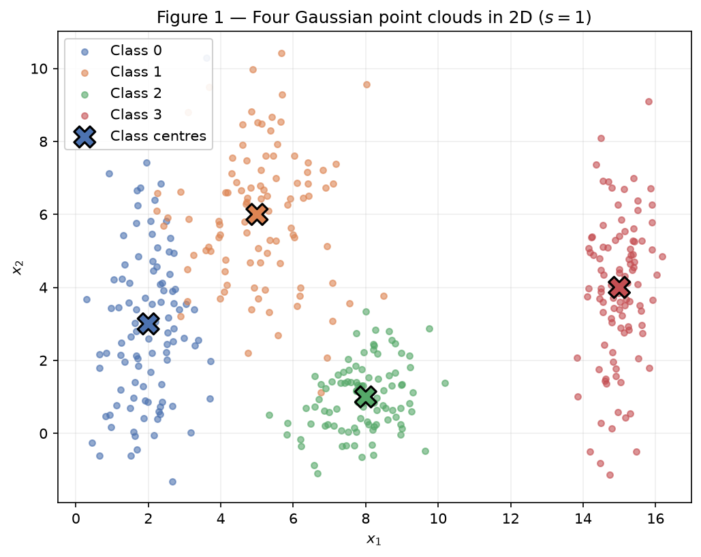
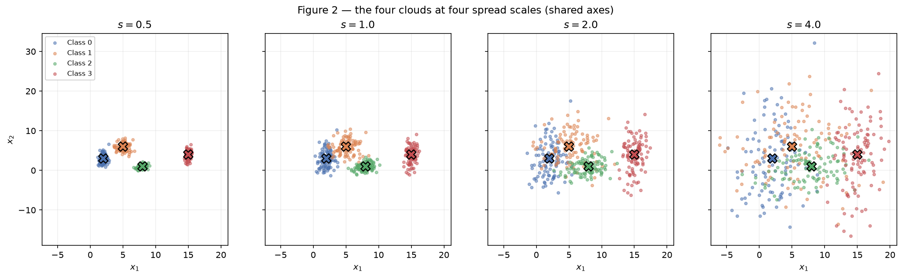
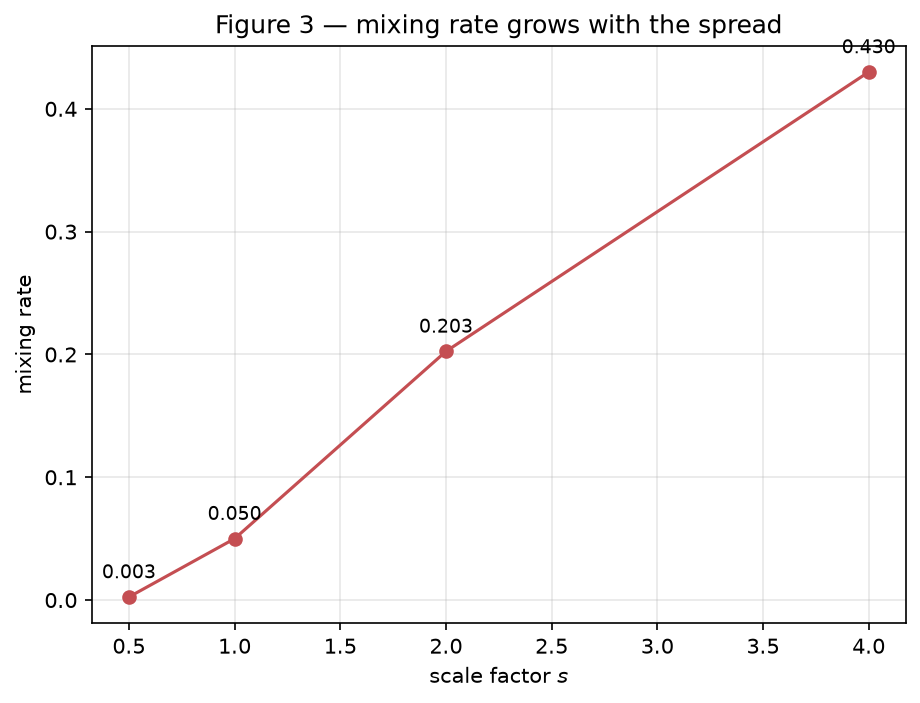
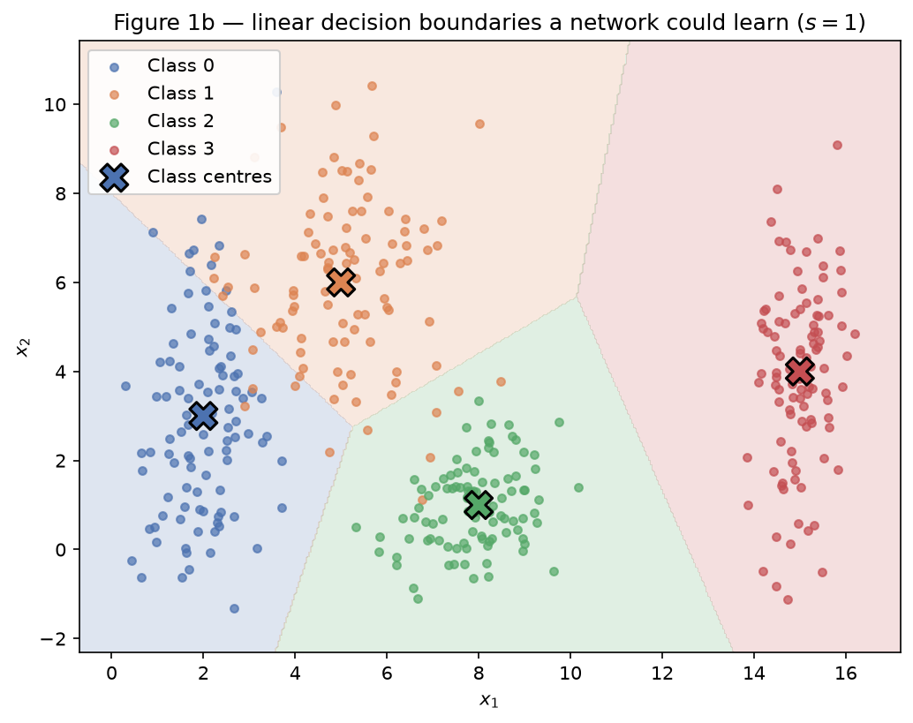

# Exercise 1 — Data

## Exercise 1

Point clouds: geometry and spread in 2D. All results use the single generator
`rng = np.random.default_rng(42)` declared once at the top of the script.

### A — Generate the clouds

400 samples split evenly across 4 classes (100 each), drawn from Gaussians with
the means and standard deviations given in the statement. Because the standard
deviations are specified per axis, each covariance is diagonal, so the clouds are
axis-aligned ellipses: class 0 (`[0.8, 2.5]`) is tall and narrow, class 2
(`[0.9, 0.9]`) is nearly circular.

Points are produced from standard normals by \(x = \mu_k + s\,\sigma_k \odot z\),
which is also what makes item B free — only \(s\) changes.

**Design decision.** The standard normals `standard_shapes` are drawn **once**,
outside `generate_clouds`, and reused at every scale factor (*common random
numbers*). The four panels of Figure 2 therefore show the *same* points merely
rescaled, so any difference between panels is caused by \(s\) alone and never by
resampling. Drawing fresh normals per scale would also be a valid reading of the
statement, but it would confound the effect of \(s\) with sampling noise.



### B — More or less spread out

The same four classes were generated four times over, with all standard
deviations multiplied by \(s \in \{0.5, 1.0, 2.0, 4.0\}\). The means never move.



#### Separation ratios at \(s = 1\)

\[ r_{ij} = \frac{\lVert \mu_i - \mu_j \rVert}{\bar{\sigma}_i + \bar{\sigma}_j},
   \qquad \bar{\sigma}_k = \frac{\sigma_{k,x} + \sigma_{k,y}}{2} \]

The ratio is dimensionless — it measures how far apart two centres are *in units
of their own spread*, which is why values from different pairs are comparable.

| Pair | \(\lVert \mu_i - \mu_j \rVert\) | \(\bar{\sigma}_i + \bar{\sigma}_j\) | \(r_{ij}\) |
|------|------|------|------|
| 0–1 | 4.243 | 3.20 | **1.326** |
| 1–2 | 5.831 | 2.45 | 2.380 |
| 0–2 | 6.325 | 2.55 | 2.480 |
| 2–3 | 7.616 | 2.15 | 3.542 |
| 1–3 | 10.198 | 2.80 | 3.642 |
| 0–3 | 13.038 | 2.90 | 4.496 |

The **smallest is the pair 0–1, at \(r_{01} = 1.326\)** — the two classes whose
centres are closest relative to how much they smear. This is visible in Figure 1
as the bleed around \(x_1 \approx 4\).

Since the means are fixed and every \(\bar{\sigma}\) is multiplied by \(s\), the
denominator scales with \(s\) while the numerator does not, so
\(r_{ij}(s) = r_{ij}(1)/s\). At \(s = 2\) the smallest ratio therefore becomes

\[ r_{01}(2) = \frac{1.326}{2} = \mathbf{0.663} \]

with no need to generate anything new.

#### Mixing rates

The mixing rate is the fraction of points whose nearest class centre is not their
own. Each point is compared against the four design means — a purely geometric
measure, nothing is trained.

| \(s\) | Mixing rate |
|------|------|
| 0.5 | 0.003 |
| 1.0 | 0.050 |
| 2.0 | 0.203 |
| 4.0 | 0.430 |



**From which scale can the clouds no longer be separated by straight lines?**
From \(s = 2\) onward. Separability degrades continuously rather than switching
off at a threshold, but \(s = 2\) is where it stops being a matter of a few
stragglers: the mixing rate quadruples from 0.050 to 0.203, so about one point in
five falls on the wrong side of every straight line drawn between the centres.

**What happens to the smallest \(r_{ij}\) there?** It crosses below 1 —
\(r_{01}(2) = 0.663\). That is the meaning of the threshold: once \(r_{ij} < 1\),
the distance between two centres is *smaller* than the spread the two clouds
carry, so their bulks physically interpenetrate. No line can separate regions that
occupy the same space. At \(s = 4\) it falls to \(r_{01}(4) = 0.332\) and the
mixing rate reaches 0.430.

### C — Analysis

**Overlap at \(s = 1\).** The four classes are mostly well separated, with one
weak point. Class 3 is isolated far to the right (\(r \geq 3.5\) against every
other class) and class 2 is compact and cleanly bounded. The genuine overlap is
between classes 0 and 1, which sit only 1.33 spread-widths apart and mix visibly
around \(x_1 \approx 4\); class 0's large vertical spread (\(\sigma_y = 2.5\))
stretches it up into class 1's territory. The measured 5.0% mixing rate is
essentially all attributable to this pair.

**Could a single linear boundary separate all classes?** No — and not because of
the geometry, but by counting. One hyperplane splits the plane into two half
spaces, so it can at best produce a 2-way decision; four classes need at least
three boundaries. A single line could only answer a binary question such as "class
3 or not".

**Could a set of linear boundaries?** Yes, at \(s = 1\), and nearly perfectly. The
regions in Figure 1b are exactly that — the nearest-centre rule partitions the
plane into Voronoi cells whose borders are straight lines (perpendicular bisectors
between centre pairs). This is why the mixing rate is the right instrument for the
question: it is literally the error rate of a piecewise-linear classifier that
already knows the true centres. At \(s = 1\) that error is 5.0%, so a set of
straight lines does almost all of the work, and a network with a single hidden
layer would have no trouble here.



**Relation to item B — what happens to the region where the network necessarily
makes mistakes?** It grows, and it becomes irreducible. The boundaries in Figure
1b do not move when \(s\) changes, because they depend only on the means, which
are fixed. What changes is how much probability mass each cloud pushes across
them. As \(s\) grows the clouds inflate over static borders, so the overlap region
fills with points of both classes; in that region the two classes are genuinely
mixed, and *no* decision rule — linear, non-linear, or arbitrarily deep — can label
both correctly, because identical positions in input space carry different labels.
This is Bayes error, not a modelling failure. The mixing-rate curve in Figure 3 is
a direct measurement of it: 0.3% at \(s = 0.5\), 43.0% at \(s = 4\). Extra network
capacity buys nothing against this; only better-separated data does.

#### Code

```python
--8<-- "docs/exercises/data/code/ex1.py"
```

## Exercise 2

### A — Dataset I: shifted Gaussians

### B — Dataset II: concentric shells

### C — Visualize and compare

### D — Analysis

## Exercise 3

### A — Get to know the data

### B — Split before you transform

### C — Preprocess

### D — Verify and visualize

## Results summary

| # | Item | Your value |
|---|------|------------|
| 1 | Mixing rate at $s = 0.5$ | 0.003 |
| 2 | Mixing rate at $s = 1.0$ | 0.050 |
| 3 | Mixing rate at $s = 2.0$ | 0.203 |
| 4 | Mixing rate at $s = 4.0$ | 0.430 |
| 5 | Smallest $r_{ij}$ at $s = 1.0$, and which pair | 1.326 — classes 0–1 |
| 6 | Distance between centers — Dataset I | |
| 7 | Distance between centers — Dataset II | |
| 8 | Explained variance PC1 + PC2 — Dataset I | |
| 9 | Explained variance PC1 + PC2 — Dataset II | |
| 10 | Share of the positive class in `Transported` | |
| 11 | Mean and median of `FoodCourt` on the training set, before transforming | |
| 12 | Final `shape` of the training feature matrix | |
| 13 | Minimum and maximum of the training and test sets after scaling | |
