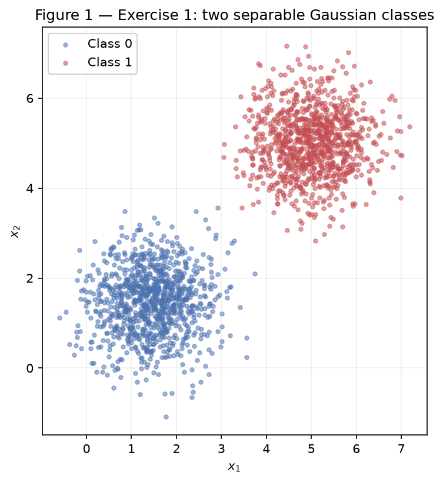
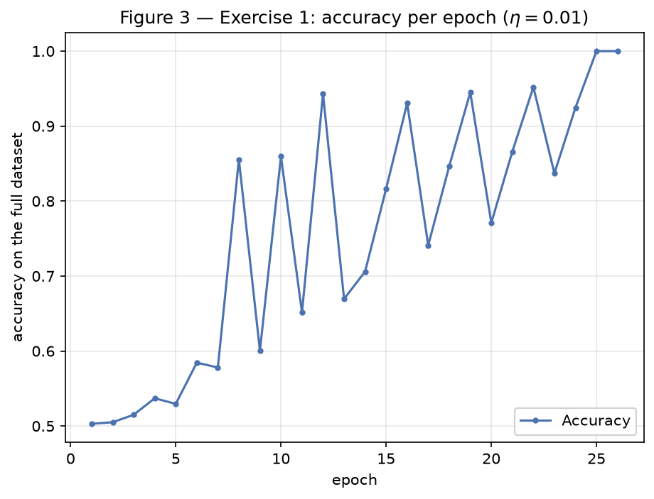
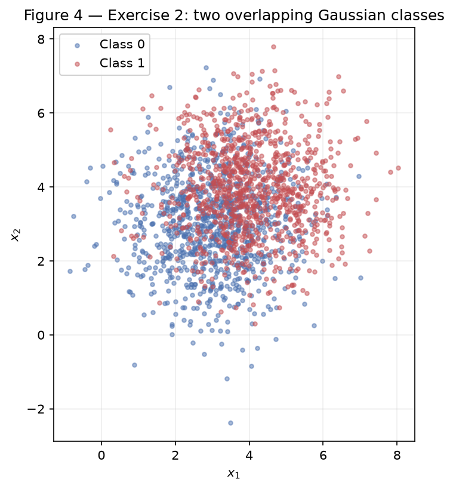
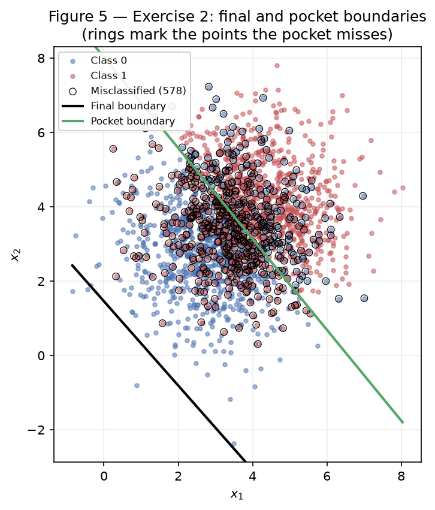
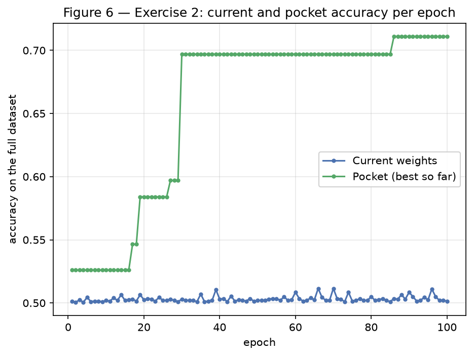

# Exercise 2 — Perceptron

One perceptron, two datasets: one it can solve and one it cannot. All results use
the single generator `rng = np.random.default_rng(42)`, declared once at the top of
the script, and every random draw (data and weight initialisation) comes from it.

## Exercise 1

Separable data: the case the perceptron was designed for.

### A — Generate the data

1000 points per class, 2000 in total, drawn with `rng.multivariate_normal` from
the means and covariance given in the statement. Both classes share the covariance
\(0.5\,I\), so each cloud is a circle with standard deviation
\(\sqrt{0.5} \approx 0.707\) along every axis and no correlation between \(x_1\)
and \(x_2\). The same function, `generate_two_classes`, builds the Exercise 2 data
with different parameters.

How separable this is can be worked out before training anything. The centres are
\(\lVert [5, 5] - [1.5, 1.5] \rVert = 3.5\sqrt{2} \approx 4.95\) apart, which is
**7 standard deviations**. With equal, circular covariances the best line is the
perpendicular bisector of the two means, \(x_1 + x_2 = 6.5\), and each mean sits
3.5 standard deviations from it. A point crosses it with probability
\(\Phi(-3.5) \approx 0.023\%\), so about 0.5 of the 2000 points would be expected
on the wrong side. In the generated sample the count is **0**: the line
\(x_1 + x_2 = 6.5\) separates the two classes perfectly, so this dataset is
linearly separable and the perceptron is guaranteed a solution.



### B — Implement the perceptron

Four small functions, plain NumPy, no model from any library:

- `step(score)` — the activation of the statement, 1 when the score is \(\geq 0\);
- `predict(points, weights, bias)` — `step` applied to every row at once, as a
  single matrix–vector product, used to measure accuracy;
- `accuracy(points, labels, weights, bias)` — the share of the full dataset the
  weights get right;
- `train_perceptron(points, labels, initial_weights, learning_rate, max_epochs)` —
  the loop.

The loop walks the samples one at a time, computes
\(\text{error} = y - \hat{y}\), and on a mistake applies
\(\mathbf{w} \leftarrow \mathbf{w} + \eta\,\text{error}\,\mathbf{x}\) and
\(b \leftarrow b + \eta\,\text{error}\). A correct prediction gives an error of 0,
so it changes nothing and the code skips it. An epoch that performs no update has
classified everything correctly, and training stops there; otherwise it stops at
100 epochs. Accuracy over the full dataset is recorded after every epoch.

Initialisation is \(\mathbf{w} = [0.002532, 0.008952]\), drawn from
`rng.normal(0, 0.01, size=2)`, and \(b = 0\), with \(\eta = 0.01\).

The pocket that Exercise 2 needs is built into this same function rather than
bolted on later, so Exercise 2 reuses the implementation unchanged: after every
update the accuracy on the full dataset is compared against the best seen so far,
and the better \((\mathbf{w}, b)\) is set aside. Exercise 1 simply has no use for
it. Nothing is ever modified in place — each update rebinds `weights` to a new
array — so the pocket can just hold a reference to the array that was current when
the record was set.

Three things needed care. The pocket's accuracy check runs after *every* update,
which is why `predict` is vectorised; written as a Python loop it would have been
the slowest part of the exercise by far. The initial weights are drawn **outside**
the training function and passed in, so that the \(\eta = 1.0\) run in item D can
start from exactly the same place and differ in the learning rate alone. And the
plot axes are pinned to the range of the data, because Exercise 2's final boundary
ends up outside the cloud and would otherwise stretch the figure until the points
were unreadable.

### C — Train and measure

| Quantity | Value |
|---|---|
| Final \(\mathbf{w}\) | \([0.050497,\ 0.028872]\) |
| Final \(b\) | \(-0.25\) |
| Epochs | 26 (of a maximum of 100) |
| Final accuracy | **100.00%** (2000 / 2000) |

Training stopped on its own: epoch 26 passed over all 2000 samples without a
single update, which is the convergence condition, not the epoch cap. Accuracy
first reached 100% at epoch 25, and the following epoch confirmed it. Across the
whole run there were only **73 updates** — 73 mistakes out of 52 000 samples
examined.




Figure 3 is worth reading carefully, because it does not climb smoothly: it
zig-zags between roughly 50% and 95% for twenty epochs before locking onto 100%.
The perceptron does not optimise accuracy — it reacts to individual mistakes — so
a single update late in an epoch can swing the boundary across the whole dataset.
Item D explains what is actually converging underneath that zig-zag.

### D — Analysis

**Why separable data converges quickly, and what happens to the updates.** Only
mistakes update. The run made 73 of them: 3 to 4 per epoch at the start, 2 to 3 in
the middle, 1 in epoch 25 and 0 in epoch 26, which is what ends training. The
count falls because each update pushes the boundary in the direction that fixes
the point it just got wrong, and on separable data those corrections do not
conflict — there exists a line that satisfies all of them at once, so the
corrections accumulate instead of cancelling.

What accumulates is visible in the numbers. The boundary starts at \(b = 0\),
which is a line **through the origin**, while the gap between the two clouds is
\(\lVert [3.25, 3.25] \rVert = 4.596\) away from the origin. The distance from the
origin to the boundary is \(|b| / \lVert \mathbf{w} \rVert\), and the run ends at
\(0.25 / 0.0582 = 4.298\) — the boundary has walked out from the origin to the gap.
That is the slow part: \(b\) moves by only \(\eta = 0.01\) per mistake, so it takes
dozens of mistakes to travel that far, and each epoch supplies only a handful.
Convergence is quick here (26 epochs) precisely because a line satisfying every
sample exists and the walk has somewhere to arrive.

**The same run with \(\eta = 1.0\).** Same data, same starting weights, only the
learning rate changed:

| | \(\eta = 0.01\) | \(\eta = 1.0\) |
|---|---|---|
| Epochs | 26 | 37 |
| Final accuracy | 100.00% | 100.00% |
| \(\mathbf{w}\) | \([0.050497,\ 0.028872]\) | \([5.870616,\ 3.359239]\) |
| \(b\) | \(-0.25\) | \(-31.0\) |
| \(\lVert \mathbf{w} \rVert\) | 0.0582 | 6.7638 |
| \(\mathbf{w} / \lVert \mathbf{w} \rVert\) | \([0.868123,\ 0.496349]\) | \([0.867950,\ 0.496652]\) |
| \(|b| / \lVert \mathbf{w} \rVert\) | 4.298 | 4.583 |

Both reach 100%, and the two directions are **0.02° apart** — practically the same
line, reached by weights that differ in length by a factor of 116. This is what
\(\eta\) controls: the *scale* of \(\mathbf{w}\), not its direction. Every update
adds \(\eta\,\mathbf{x}\), so the final weight vector is the initial one plus
\(\eta\) times a sum of data points; changing \(\eta\) multiplies that sum, and the
boundary \(\mathbf{w} \cdot \mathbf{x} + b = 0\) does not care about the length of
\(\mathbf{w}\).

The epoch counts differ (26 against 37) because the starting weights have a
magnitude of about 0.01. With \(\eta = 1.0\) each update is of size
\(\lVert \mathbf{x} \rVert \approx 5\), so the initial weights are swamped
immediately and the run behaves as if it had started from zero. With
\(\eta = 0.01\) each update is about 0.05, the same order as the starting vector
itself, so the initial weights keep influencing which samples are misclassified,
and a different sequence of mistakes takes a different number of epochs. Small
\(\eta\) does not mean careful learning here — it means the arbitrary starting
point matters longer.

**What would have happened from \(\mathbf{w} = \mathbf{0}\), \(b = 0\).** Run the
whole training twice, identically, except with \(\eta_1\) and \(\eta_2\), and write
\(c = \eta_2 / \eta_1 > 0\). Claim: after every update \(k\),

\[ \mathbf{w}^{(2)}_k = c\,\mathbf{w}^{(1)}_k, \qquad b^{(2)}_k = c\,b^{(1)}_k \]

*Base case.* \(\mathbf{w}^{(1)}_0 = \mathbf{w}^{(2)}_0 = \mathbf{0}\) and
\(b^{(1)}_0 = b^{(2)}_0 = 0\), and \(c \cdot 0 = 0\).

*Inductive step.* Assume it holds at step \(k\). For any sample \(\mathbf{x}\),

\[ \mathbf{w}^{(2)}_k \cdot \mathbf{x} + b^{(2)}_k
   = c\,(\mathbf{w}^{(1)}_k \cdot \mathbf{x} + b^{(1)}_k) \]

Since \(c > 0\), both scores have the same sign, so
\(\text{step}(\cdot)\) returns the same \(\hat{y}\) — the two runs see the *same*
prediction, therefore the same error \(e\), on the same sample. Both update, and

\[ \mathbf{w}^{(2)}_{k+1} = c\,\mathbf{w}^{(1)}_k + \eta_2 e \mathbf{x}
   = c\,(\mathbf{w}^{(1)}_k + \eta_1 e \mathbf{x}) = c\,\mathbf{w}^{(1)}_{k+1} \]

and identically \(b^{(2)}_{k+1} = c\,b^{(1)}_{k+1}\), which closes the induction.

So the two runs make the same mistakes on the same samples in the same order. The
decision boundary is the set \(\{\mathbf{x} : \mathbf{w} \cdot \mathbf{x} + b = 0\}\),
and multiplying \(\mathbf{w}\) and \(b\) by \(c > 0\) leaves that set unchanged;
the epoch count, the accuracy curve and every prediction are identical. From a
zero start \(\eta\) has no effect whatsoever, which is why item B requires a
non-zero initialisation — otherwise the comparison above would have nothing to
compare.

## Exercise 2

Overlapping data: the case the perceptron cannot solve.

### A — Generate the data

Same procedure and same function, only the parameters change: class means
\([3, 3]\) and \([4, 4]\), shared covariance \(1.5\,I\), 1000 points per class.

Both changes work against separability. The variance is three times that of
Exercise 1, so the standard deviation grows by \(\sqrt{3}\) to
\(\sqrt{1.5} \approx 1.225\). At the same time the centres move closer, from 4.95
to \(\sqrt{2} \approx 1.414\) apart, which is only **1.15 standard deviations**.

The calculation from Exercise 1 applies unchanged. The best line is now
\(x_1 + x_2 = 7\), and each mean sits only \(0.707 / 1.225 \approx 0.577\)
standard deviations from it, so \(\Phi(-0.577) \approx 28.2\%\) of each class
lands on the wrong side of even the best possible line. No linear classifier can
expect more than about **71.8%** accuracy on this distribution, which is the
"about 73%" ceiling the statement quotes (a finite sample can sit slightly above
the population value). Figure 4 shows why: the mistakes are not a few stragglers
but a wide band where the two clouds overlap.



### B — Train, keeping the best weights

The Exercise 1 implementation, unchanged, with \(\eta = 0.01\) and the same
100-epoch cap. Initial weights \([0.012158, -0.004510]\), \(b = 0\).

| | \(\mathbf{w}\) | \(b\) | Accuracy |
|---|---|---|---|
| Final weights | \([0.054484,\ 0.048043]\) | \(-0.07\) | **50.15%** |
| Pocket weights | \([0.010664,\ 0.008727]\) | \(-0.07\) | **71.10%** |

The pocket record was set in **epoch 86**, and training used all 100 epochs: no
epoch ever passed without an update, so the stopping condition that ended
Exercise 1 in 26 epochs never fired. The pocket's 71.10% sits just under the
71.8% ceiling computed in item A, so it is essentially the best a straight line
can do here. The final weights score 50.15%, which is what guessing the majority
class would give.

### C — Figures





The rings in Figure 5 mark the 578 points the *pocket* boundary misses — the
overlap band predicted in item A. The final boundary needs no rings: it sits
outside the cloud entirely, in the bottom-left corner, with 99.85% of the data on
its class-1 side.

### D — Analysis

**Why the final weights score 50% and the pocket weights 71%.** The two boundaries
in Figure 5 are not variations on the same idea — one is a classifier and the
other is not. Measured from the centre of the data at \([3.5, 3.5]\):

| Boundary | Distance from the cloud centre |
|---|---|
| Pocket | 0.155 |
| Final | 3.976 |
| (furthest point from the centre) | 5.876 |

The pocket line passes through the middle of the cloud and splits it. The final
line sits almost 4 units away, past the bulk of the points, so it puts 99.85% of
them on one side and calls them all class 1. With 1000 of each class, calling
everything class 1 scores exactly 50%, and 50.15% is what it scored.

The training loop leaves it there because of the asymmetry the statement's hint
points at. For this data the mean \(\lVert \mathbf{x} \rVert\) is **5.111**, so on
each mistake

\[ \Delta b = \eta = 0.01, \qquad
   \lVert \Delta \mathbf{w} \rVert = \eta \lVert \mathbf{x} \rVert \approx 0.05 \]

The offset of the boundary from the origin is
\(|b| / \lVert \mathbf{w} \rVert\), and the cloud centre is 4.95 from the origin,
so a boundary that cuts through the data needs that ratio near 4.95. But its
numerator grows five times more slowly than its denominator: the bias cannot
outrun the weights, and the run ends at \(|b| / \lVert \mathbf{w} \rVert = 0.964\).
The boundary is effectively pinned near the origin, where the entire cloud lies on
one side of it — the perceptron can *rotate* a boundary quickly and can only
*translate* it at a crawl.

The same asymmetry explains the shape of the oscillation. Every point sits about 5
units from the origin in the same quadrant, so one update changes another point's
score by roughly \(\eta\,\mathbf{x}_i \cdot \mathbf{x}_j \approx 0.01 \times 25 =
0.25\), while a typical score is only \(\lVert \mathbf{w} \rVert \times 5 \approx
0.28\). A single correction therefore flips nearly every prediction at once. That
is why each epoch contains only 2 to 5 updates rather than the ~1000 one might
expect from a 50% error rate: the loop swings between "everything is class 0" and
"everything is class 1", and within each block of identical labels only the first
sample or two misfires. The points are stacked class 0 first, so every epoch ends
just after the class-1 block, which is why the epoch-end snapshot is always the
"everything is class 1" extreme.

The pocket weights are not the product of better learning. They are a moment the
loop passed through in epoch 86 and destroyed on the very next update. The pocket
is memory, not search.

**Figure 3 against Figure 6.** In Exercise 1 the curve zig-zags and then settles
at 100% and the loop halts itself. In Exercise 2 the accuracy of the current
weights stays inside the band **50.05%–51.15%** for all 100 epochs, with no trend:
epoch 100 is statistically indistinguishable from epoch 30. The pocket curve rises
in steps and then flattens, which is a property of "best so far" and not of
learning.

The perceptron convergence theorem guarantees that **if** the classes are linearly
separable with some margin \(\gamma > 0\), the algorithm makes at most
\((R/\gamma)^2\) mistakes and therefore terminates. It is the separability
assumption that this dataset breaks. There is no line with all class 0 on one side
and all class 1 on the other, so \(\gamma\) does not exist and the bound is
vacuous. Every possible weight vector misclassifies at least ~28% of the points,
every misclassified point forces an update, and each update spoils points that
were correct — there is no fixed point for the loop to reach. Exercise 1 stopped
because an error-free pass existed; here one cannot.

**Would more epochs help? No.** The loop has exactly one stopping condition, an
epoch with no updates, and that requires a line with zero errors on data where the
minimum is about 560. Running 10 000 epochs would produce 10 000 more oscillations
of the same band in Figure 6, because the update rule has no memory of accuracy
and no notion of "worse": it reacts only to the sample in front of it and will
undo a good boundary for the sake of one overlapping point. The pocket best would
creep up slightly by luck, towards the 71.8% ceiling, but the weights themselves
never settle.

**Would a smaller \(\eta\) help? No**, and the update rule says why. Both updates
carry the *same* \(\eta\): \(\Delta b = \eta\) and
\(\Delta \mathbf{w} = \eta\,e\,\mathbf{x}\). The quantity that decides where the
boundary sits is the ratio \(|b| / \lVert \mathbf{w} \rVert\), and \(\eta\) cancels
in it — halving the learning rate halves both the bias steps and the weight steps,
leaving the geometry of the boundary exactly where it was. This is the same
argument as item D of Exercise 1, where a zero start made \(\eta\) a pure rescaling;
here the starting weights are near zero and the effect is nearly that. A smaller
\(\eta\) makes the oscillation slower, not smaller.

What actually fixes it is a change of algorithm, not of hyper-parameters: keep the
pocket (as here), or replace the step function and the error-driven rule with a
loss that measures *how wrong* a point is and can trade one mistake off against
another, or move to a model that is not restricted to a single straight line.

## Code

```python
--8<-- "docs/exercises/perceptron/code/perceptron.py"
```

## Results summary

| # | Quantity | Value |
|---|---|---|
| 1 | Exercise 1 — final \(\mathbf{w}\) and \(b\) | \(\mathbf{w} = [0.050497,\ 0.028872]\), \(b = -0.25\) |
| 2 | Exercise 1 — epochs to convergence | 26 (100% at epoch 25, confirmed by an update-free epoch 26) |
| 3 | Exercise 1 — final accuracy | 100.00% (2000 / 2000) |
| 4 | Exercise 1 — epochs and final accuracy with \(\eta = 1.0\) | 37 epochs, 100.00% |
| 5 | Exercise 2 — final \(\mathbf{w}\) and \(b\) | \(\mathbf{w} = [0.054484,\ 0.048043]\), \(b = -0.07\) |
| 6 | Exercise 2 — accuracy of the final weights | 50.15% |
| 7 | Exercise 2 — accuracy of the pocket weights | 71.10% |
| 8 | Exercise 2 — epoch at which the pocket best occurred | 86 |
